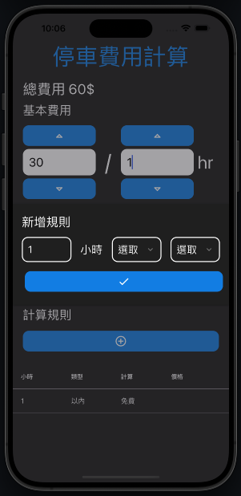

# ParkPal

ParkPal helps you calculate your parking fees.



## Installation

You can download the compiled version of this project for android here <a href="https://github.com/Maxhu787/Cnt-Dwn/blob/main/android-build.apk">download</a>
<br/>or build it yourself below

## Build Guide

### Setup

```bash
git clone https://github.com/Maxhu787/carpark-count.git
```

```bash
cd my-app
npm run start
```

#### android

```bash
eas build --local --profile production --platform android
```

#### ios

```bash
eas build --local --profile production --platform ios
```

#### web

```bash
npx expo export --platform web
```

<a href="https://maxhu787.github.io/">Hu Kaixiang</a> 2024 12/04 ~ 12/06<br/>
